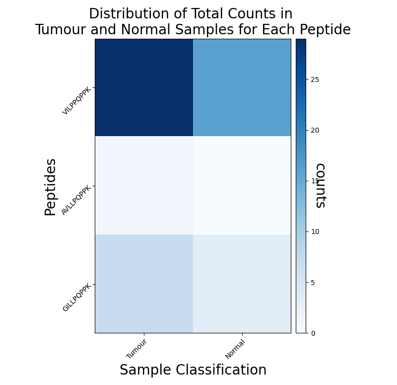
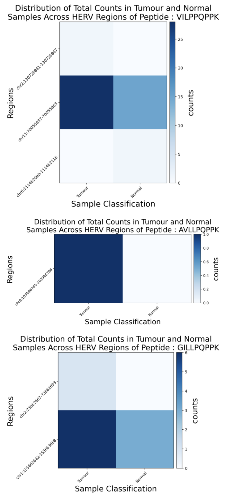
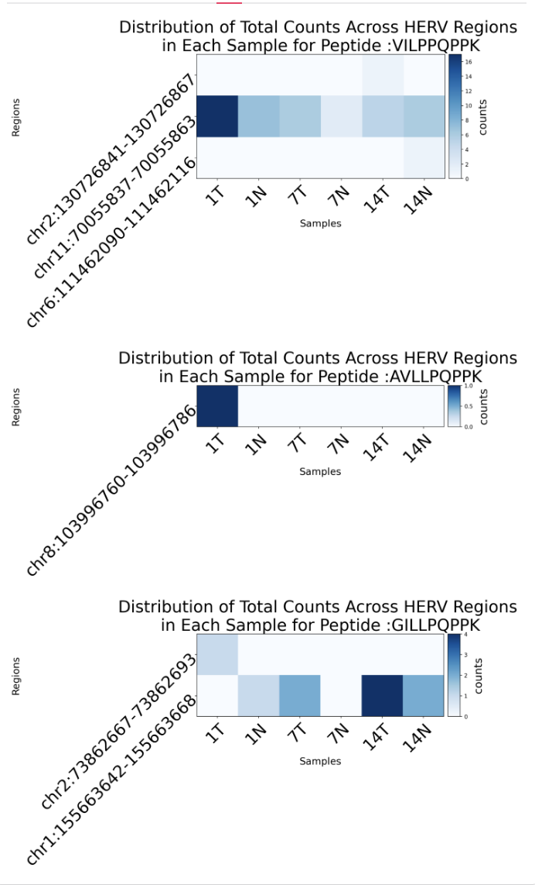

# HERVOminer

## Table of Contends
- [Description](#description)
- [Installation](#installation)
	- [System Requirements](#system-requirements)
	- [Installing Miniconda](#installing-miniconda)
	- [Setting Up a Conda Environment](#setting-up-a-conda-environment)
	- [Installing HERVOminer](#installing-hervominer)
- [Implementation](#implementation)
	- [Input files format](#input-files-format)
	- [Separated Subcommands](#separated-subcommands)
	- [Single Command Workflow](#single-command-workflow)
	- [Streamlit Interface](#streamlit-interface)
- [Example final outputs](#example-final-outputs)

## Description
HERVOminer is a user-friendly toolkit that offers both an interactive web interface and a command-line interface. The website can be found in : https://... 
The tool identifies the HERV origins of query peptides, quantifies their expression and visualizes the results.

## Installation

### System Requirements
HERVOminer is designed for Linux operating systems, full compatibility is only guaranteed on Linux.

### Installing Miniconda

HERVOminer utilizes tools from Bioconda, a channel for bioinformatics software of Conda. To ensure easy installation of the dependencies, it is recommended to install Miniconda if you do not have Conda or Miniconda installed. 

Please visit the [Miniconda installation page](https://docs.conda.io/projects/miniconda/en/latest/miniconda-install.html) and follow the installation instructions to install Miniconda.

### Setting Up a Conda Environment
It is recommended to create a Conda environment for using HERVOminer to avoid conflicts. 

Please use the following commands to create and activate a new environment:

```bash
conda create -n HERVOminer_env python=3.11
conda activate HERVOminer_env
```

### Installing HERVOminer

1. Clone the repository
```bash
git clone https://github.com/jade-f-t/HERVOminer.git
cd HERVOminer
```

2. Installing Dependencies \
Please use the following commands to install the dependencies:

```bash
conda config --add channels conda-forge
conda install bioconda::subread=2.0.6
conda install bioconda::bedtools=2.31.0
conda install bioconda::blast=2.16.0
pip install -r requirements.txt
```

3. Decompress Data \
Please decompress the included compressed data files before use, as they contain essential data required for the operation of HERVOminer.

```bash
cd data 
tar -xzvf HERV_ORF_dict.tar.gz
tar -xzvf HervOrfBlastpDB.tar.gz
cat hg19.tar.gz.part* > hg19.tar.gz
tar -xzvf hg19.tar.gz
cd ..
```

4. Grant execution permission to the HERVOminer.py script
```bash
chmod +x ./src/HERVOminer.py
```

## Implementation

HERVOminer is a toolkit designed for analyzing MHC-I-presented peptides (MPPs). HERVOminer processes 2 databases and 2 user inputs to generate 3 tables and 3 plots for the analytical results. The command line can be executed individually using 4 subcommands, or can be performed all at once with a single command. 

### Input files format
1. post-processed RNA BAM (Binary Alignment/Map) files
- Description : \
A CSV file summarizing directories of post-processed alignment files for the samples.
Each tumor sample need to have its matched normal sample. The sample id fields of the tumor and corresponding normal sample have to be same and the sample type field should state whether the sample is tumor (T) or normal (N) sample. The directory has to be absolute directory. \
- Format : \
3 fields : sample id, sample type (T / N), directory
- Example input format : 


| <!-- -->    | <!-- -->    | <!-- -->    |
|-------------|-------------|-------------|
| 10   | T   | /Users/jade-f-t/data/10T.bam   | 
| 10   | N   | /Users/jade-f-t/data/10N.bam   | 
| 21   | T   | /Users/jade-f-t/data/21T.bam   |
| 21   | N   | /Users/jade-f-t/data/21N.bam   |
| ...     | ...     | ...     |


2. query peptide 
- Description : \
The absolute directory of the query peptides FASTA file.

### Separated Subcommands

1. STEP 1 : Protein BLAST Similarity Analysis (BLAST) 
	- **Description:** \
	8 to 11 amino acid length target peptides are aligned to the local ORF database of HERV regions using Protein BLAST to calculate regions of similarity.
	- **Usage:** 
	```bash 
	./src/HERVOminer.py blastORF \
	-p <path to the input peptide file> \
	-o <path to the output file>
	``` 
	- **Output:** blastp_output.txt 


2. STEP 2 : BLAST results selection, Annotation file generation
	- **Description:**
	Selection is based on identity and alignment length, obtaining the positions of target peptides on all candidate HERV ORFs. HERV fragments that are not 100% matched or have different lengths with the query peptides are filtered. The output annotation file is in GTF format and contains the detailed annotation of genetic features of the corresponding HERV region of the BLAST results.
	- **Usage:** 
	```bash
	./src/HERVOminer.py summarizeAnnotate \
	-i <path to the input blastp output file get from Step 1> \
	-o <path to the output file>
	``` 
	- **Output:** output_dict.json, quantification.gtf 

3. STEP 3 : Quantification of candidate HERV fragments (featureCounts)
	- **Description :** \
	RNA sequencing BAM files from the samples and genomic positions recorded in the GTF are integrated to quantify expression levels using FeatureCounts
	- **Usage :**
	```bash
	./src/HERVOminer.py quantification \
	-i <path to the input csv file with all of the bam file path> \
	-a <path to the annotation file created by Step 2> \
	-o <path to the output file> \
	-t <no of threads to use for one sample> \
	-n <number of sample to be analyzed in parallel computing>
	```
	- **Output :** output files of featureCounts, csv files for tumor and normal featureCounts   
	output directories (resultDirectories_T.csv and resultDirectories_N.csv)

4. STEP 4 : Annotation of DNA sequences for experimental validation and visualization of quantification results for candidate HERV fragments
	- **Description :** \
	3 tables and 3 plots which summarizing the results will be generated directly on the page. Please download them directly by clicking the download button beside them if needed.
	- **Usage :**
	```bash
	./src/HERVOminer.py outputResult \
	-p <path to the input peptide file> \ 
	-i <path to the input csv file with all of the bam file path> \ 
	-T <path to the resultDirectories_T.csv file> \ 
	-N <path to the resultDirectories_N.csv file> \ 
	-z <include region with zero count or not, 1 : with zero, 0: without zero, optional argument, default value : 0> \ 
	-o <path to the output file, optional argument, default value : current directory>
	-d <set the dpi of the figures, optional argument, default value : 100>
	-sr <selected regions to appear in the plots in the form <region_id>,<region_id>,... eg. 2_1_3166,10_1_3514,15_1_2630, optional argument, defualt value : None>
	-sp <selected peptide to generate respective plots, please input the id of the peptide (shown on the table 'Maximal HERV Region Counts per Query Peptide Across All Sample'), optional argument, defualt value : None>
	```
	- **Output :** 3 Tables , 3 Figures

### Single Command Workflow
- **Description :** \
This command can finish all of the above steps all at once. The outputs are same as the above.
- **Usage :**
```bash
./src/HERVOminer.py HERVOminer \
-p <path to the input peptide file> \ 
-i <path to the input csv file with all of the bam file path> \ 
-t <no of threads to use for one sample> \
-n <number of sample to be analyzed in parallel computing> \
-z <include region with zero count or not, 1 : with zero, 0: without zero> \ 
-o <path to the output file>
-d <set the dpi of the figures>
-sr <selected regions to appear in the plots in the form <region_id>,<region_id>,... eg. 2_1_3166,10_1_3514,15_1_2630, optional argument, defualt value : None>
-sp <selected peptide to generate respective plots, please input the id of the peptide (shown on the table 'Maximal HERV Region Counts per Query Peptide Across All Sample'), optional argument, defualt value : None>
```

## Example final outputs

### Figure 1 : Distribution of Total Counts in Tumor and Normal Samples for Each Peptide
- **Description :** \
a heatmap comparing total counts of tumor and normal samples in each peptide


### Figure 2 : Distribution of Total Counts in Tumor and Normal Samples Across HERV Regions of Each Query Peptide
- **Description :** \
heatmaps for each peptide which shows distribution of total counts of corresponding HERV region sequences.  \


### Figure 3 : Distribution of Total Counts Across HERV Regions in Each Sample for Peptide
- **Description :** \
heatmaps for each peptide, which shows the distribution of total counts of each HERV region within an individual sample. \


### Table 1 : Quantification Summary Across All Samples
- **Description :** \
A comprehensive summary of all quantification results. 
- **Fields :**  
	- *Sample* - Sample Id 
	- *HERV regions* - location of the region 
	(format : chr{}:{start position}-{end position})
	- *Tumor reads* - the total read of the HERV region in all of the tumour samples
	- *Total reads* - the total read of the HERV region in all of the samples
	- *Sample total reads* - the total read of the HERV region in the specific sample
	- *ORF* - the ID of the open reading frame of the HERV region
	- *TSA* - the amino acid sequence of the TSA
	- *Strand* - "+" : forward strand, "-" : reverse strand\
	- *Validation reading sequence* - DNA sequence of the ORF with additional sequence ~60 nucleotides before and after the original sequence


| Sample | HERV regions           | Tumour reads | Total reads | Sample total reads | ORF                              | TSA       | Strand | Validation reading sequence                                                                                                                                                  |
|--------|------------------------|--------------|-------------|--------------------|----------------------------------|-----------|--------|------------------------------------------------------------------------------------------------------------------------------------------------------------------|
|14T|chr2:130726841-130726867|1|1|1|4_1_679_chr2_130719470-130727258_5_ORF74|VILPPQPPK|+|TACAGTGGAGTACACTGGTACAATTATAGCTCACTGCAGACTCAAACTCCTGGGCTAAAGTTATCCTCCCACCTCAGCCTCCCAAGTAGCTGGGATCATCACAGGCATGCACCACCACGCCTGGCTAGGTTTTTTGTTTTTTATTT|
|1N|chr11:70055837-70055863|28|43|7|9_1_3537_chr11_70055744-70066106_2_ORF96|VILPPQPPK|-|TTTTTTTAGAGATGAGGTTTCCCTATGTTGGCGAGGCTGGCCTCAAACTCCTGGGTTCAAGTAATCCTCCCACCTCAGCCTCCCAAAGTGCAGGGATTACAGATGAGAGCCACTGCACCTGGCCTAGCGCCCAGTTTTAATTGAGG|
|7N|chr11:70055837-70055863|28|43|2|9_1_3537_chr11_70055744-70066106_2_ORF96|VILPPQPPK|-|TTTTTTTAGAGATGAGGTTTCCCTATGTTGGCGAGGCTGGCCTCAAACTCCTGGGTTCAAGTAATCCTCCCACCTCAGCCTCCCAAAGTGCAGGGATTACAGATGAGAGCCACTGCACCTGGCCTAGCGCCCAGTTTTAATTGAGG|
| ... | ... | ... | ... | ... | ... | ... | ... | ... |

### Table 2 : Maximal HERV Region Counts per Query Peptide Across All Samples

- **Description :** \
Identifies the HERV region with the highest total counts for each query peptide \
- **Fields :** 
	- *Peptide* - Peptide Id 
	- *HERV regions* - location of the region 
	(format : chr{}:{start position}-{end position})
	- *Tumor reads* - the total read of the HERV region in all of the tumour samples
	- *Total reads* - the total read of the HERV region in all of the samples
	- *ORF* - the ID of the open reading frame of the HERV region
	- *TSA* - the amino acid sequence of the TSA
	- *Strand* - "+" : forward strand, "-" : reverse strand
	- *Validation reading sequence* - DNA sequence of the ORF with additional sequence ~60 nucleotides before and after the original sequence

| Peptide | HERV regions            | Tumour reads | Total reads | ORF                                   | TSA       | Strand | Validation reading sequence                                                                                                                                 |
|---------|-------------------------|--------------|-------------|---------------------------------------|-----------|--------|---------------------------------------------------------------------------------------------------------------------------------------------------|
|1|chr11:70055837-70055863|28|43|9_1_3537_chr11_70055744-70066106_2_ORF96|VILPPQPPK|-|TTTTTTTAGAGATGAGGTTTCCCTATGTTGGCGAGGCTGGCCTCAAACTCCTGGGTTCAAGTAATCCTCCCACCTCAGCCTCCCAAAGTGCAGGGATTACAGATGAGAGCCACTGCACCTGGCCTAGCGCCCAGTTTTAATTGAGG|
|2|chr8:103996760-103996786|1|1|21_2_2916_chr8_103991601-104003946_6_ORF54|AVLLPQPPK|+|CAAGCTGGAGTGCAGTGGCACAATCTCGGGTCACTGCAACCTCCGCCTCCCAGATTCAAGCAGTTCTCCTGCCTCAGCCTCCCAAATAGCTGGGATTACAGGCACCTGCCACCATGTCTGGCTAAATTTTTGTATTTTTTTAGTAG|
|3|chr1:155663642-155663668|6|9|28_3_6073_chr1_155661620-155669313_3_ORF51|GILLPQPPK|-|ACAGGCTGGAGTGCAATGGCGCAATCTCAGCTCACTGCAACCTCCGCCCCCCAAGTTCAAGGGATTCTCCTGCCTCAGCCTCCCAAGTAGCTGCGATTACAGGCATGTGCCACCACACCCTGCTAATTTTGTATTTTTAGTAGAGA|


### Table 3 : Maximal HERV Region for Each Query Peptide by Sample
- **Description :** \
Shows the HERV region with the highest count in the individual sample for each peptide


| Peptide |1N|7N|14N|1T|7T|14T|
|---------|-------------------------------------------|-------------------------------------------|-------------------------------------------|-------------------------------------------|------------------------------------------|------------------------------------------|
|1|9_1_3537_chr11_70055744-70066106_2_ORF96|9_1_3537_chr11_70055744-70066106_2_ORF96|9_1_3537_chr11_70055744-70066106_2_ORF96|9_1_3537_chr11_70055744-70066106_2_ORF96|9_1_3537_chr11_70055744-70066106_2_ORF96|9_1_3537_chr11_70055744-70066106_2_ORF96 |
|2|no read|no read|no read|21_2_2916_chr8_103991601-104003946_6_ORF54|no read|no read|
|3|28_3_6073_chr1_155661620-155669313_3_ORF51|no read|28_3_6073_chr1_155661620-155669313_3_ORF51|24_3_572_chr2_73854772-73867144_3_ORF95|28_3_6073_chr1_155661620-155669313_3_ORF51|28_3_6073_chr1_155661620-155669313_3_ORF51|


