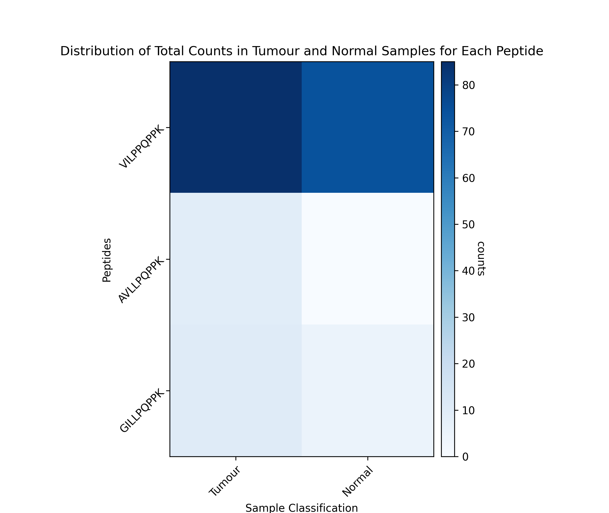
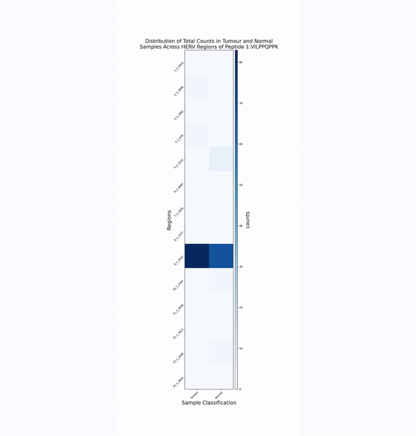
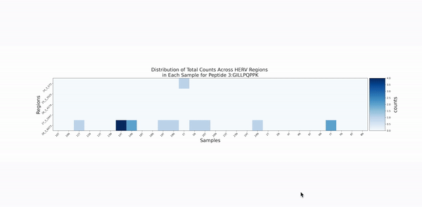

# HERVOminer

## Table of Contends
- [Description](#description)
- [Installation](#installation)
	- [System Requirements](#system-requirements)
	- [Installing Miniconda](#installing-miniconda)
	- [Setting Up a Conda Environment](#setting-up-a-conda-environment)
	- [Installing HERVOminer](#installing-hervominer)
- [Implementation](#implementation)
	- [Input files format](#input-files-format)
	- [Separated Subcommands](#separated-subcommands)
	- [Single Command Workflow](#single-command-workflow)
- [Example final outputs](#example-final-outputs)

## Description
HERVOminer is a tool that capable of determining whether the query peptides originated from Human Endogenous retroviruses (HERVs) regions, quantify their expression and visualize the result.

## Installation

### System Requirements
HERVOminer is designed for Linux operating systems, full compatibility is only guaranteed on Linux.

### Installing Miniconda

HERVOminer utilizes tools from Bioconda, a channel for bioinformatics software of Conda. To ensure easy installation of the dependencies, it is recommended to install Miniconda if you do not have Conda or Miniconda installed. 

Please visit the [Miniconda installation page](https://docs.conda.io/projects/miniconda/en/latest/miniconda-install.html) and follow the installation instructions to install Miniconda.

### Setting Up a Conda Environment
It is recommended to create a Conda environment for using HERVOminer to avoid conflicts. 

Please use the following commands to create and activate a new environment:

```bash
conda create -n HERVOminer_env python=3.11
conda activate HERVOminer_env
```

### Installing HERVOminer

1. Clone the repository
```bash
git clone https://github.com/jade-f-t/HERVOminer.git
cd HERVOminer
```

2. Installing Dependencies \
Please use the following commands to install the dependencies:

```bash
conda install bioconda::subread=2.0.6
conda install bioconda::bedtools=2.31.0
conda install bioconda::blast= 2.15.0
pip install -r requirements.txt
```

3. Decompress Data \
Please decompress the included compressed data files before use, as they contain essential data required for the operation of HERVOminer.

```bash
cd data 
tar -xzvf HERV_ORF_dict.tar.gz
tar -xzvf HervOrfBlastpDB.tar.gz
cat hg19_part_* > hg19.tar.gz
tar -xzvf hg19.tar.gz
cd ..
```

4. Grant execution permission to the HERVOminer.py script
```bash
chmod +x ./src/HERVOminer.py
```

## Implementation

HERVOminer is designed to determine whether the query peptides are derived from the HERV regions and quantify the corresponding sequences. HERVOminer processes 2 databases and 2 user inputs in 4 steps and generates 3 tables and 3 graphs of the analytical results. The 4 steps can be executed individually using 4 subcommands, or can be performed all at once with a single command.

### Input files format
1. RNA-seq CSV
- Description : \
A CSV file summarizing directories of post-processed alignment files for the samples.
Each tumor sample need to have its corresponding normal sample. The sample id fields of the tumor and corresponding normal sample have to be same and the sample type field should state whether the sample is tumor (T) or normal (N) sample. The directory has to be absolute directory.
- Format : \
3 fields : sample id, sample type (T / N), directory
- Example input format : 


| <!-- -->    | <!-- -->    | <!-- -->    |
|-------------|-------------|-------------|
| 10   | T   | /Users/jade-f-t/data/10T.bam   | 
| 10   | N   | /Users/jade-f-t/data/10N.bam   | 
| 21   | T   | /Users/jade-f-t/data/21T.bam   |
| 21   | N   | /Users/jade-f-t/data/21N.bam   |
| ...     | ...     | ...     |


2. query peptide 
- Description : \
The absolute directory of the query peptides FASTA file.
- Example input format : \
/Users/jade-f-t/data/input_peptide.fasta

### Separated Subcommands

1. Protein BLAST Similarity Analysis (BLAST)
- Description : \
Find regions of similarity between query peptides and the open reading frames of HERV regions. 
- Usage :
```bash
./src/HERVOminer.py blastORF \
-p <path to the input peptide file> \
-o <path to the output file>
```
- Output : blastp_output.txt

2. BLAST results summarisation, Annotation file generation
- Description : \
Filter BLAST results of protein BLAST , and summarize their information.Then, generate the corresponding annotation file for the following quantification process.
- Usage :
```bash
./src/HERVOminer.py summarizeAnnotate \
-i <path to the input blastp output file get from Step 1> \
-o <path to the output file>
```
- Output : output_dict.json, quantification.gtf

3. Quantification (featureCounts)
- Description : \
Use FeatureCountsto quantify each BLAST result remaining after filtering.
- Usage :
```bash
./src/HERVOminer.py quantification \
-i <path to the input csv file with all of the bam file path> \
-a <path to the annotation file created by Step 2> \
-o <path to the output file> \
-t <no of threads to use for one sample> \
-n <number of sample to be analyzed in parallel computing>
```
- Output : output files of featureCounts, csv files for tumor and normal featureCounts   
output directories (resultDirectories_T.csv and resultDirectories_N.csv)

4. Data summarisation and visualization
- Description : \
Generate three tables and three groups of graphs from the quantification results.
- Usage :
```bash
./src/HERVOminer.py outputResult \
-p <path to the input peptide file> \ 
-i <path to the input csv file with all of the bam file path> \ 
-T <path to the resultDirectories_T.csv file> \ 
-N <path to the resultDirectories_N.csv file> \ 
-z <include region with zero count or not, 1 : with zero, 0: without zero> \ 
-o <path to the output file>
-d <set the dpi of the figures>
```
- Output : 3 Tables , 3 Figures

### Single Command Workflow
- Description : \
This command can finish all of the above steps all at once. The outputs are same as the above.
- Usage :
```bash
./src/HERVOminer.py HERVOminer \
-p <path to the input peptide file> \ 
-i <path to the input csv file with all of the bam file path> \ 
-t <no of threads to use for one sample> \
-n <number of sample to be analyzed in parallel computing> \
-z <include region with zero count or not, 1 : with zero, 0: without zero> \ 
-o <path to the output file>
-d <set the dpi of the figures>
```

## Example final outputs

### Figure 1 : Distribution of Total Counts in Tumor and Normal Samples for Each Peptide
- Description : \
a heatmap comparing total counts of tumor and normal samples in each peptide


### Figure 2 : Distribution of Total Counts in Tumor and Normal Samples Across HERV Regions of Each Query Peptide
- Description : \
heatmaps for each peptide which shows distribution of total counts of corresponding HERV region sequences.  \


### Figure 3 : Distribution of Total Counts Across HERV Regions in Each Sample for Peptide
- Description : \
heatmaps for each peptide, which shows the distribution of total counts of each HERV region within an individual sample. \


### Table 1 : Quantification Summary Across All Samples
- Description : \
A comprehensive summary of all quantification results


| Sample | HERV regions           | Tumour reads | Total reads | Sample total reads | ORF                              | TSA       | Strand | Padding sequence                                                                                                                                                  |
|--------|------------------------|--------------|-------------|--------------------|----------------------------------|-----------|--------|------------------------------------------------------------------------------------------------------------------------------------------------------------------|
| 11T    | chr14:31742452-31742478 | 1            | 1           | 1                  | 2_1_4099_chr14_31741013-31750035_3_ORF19 | VILPPQPPK | +      | TTTAGTAGAGACAGGGTTTCTCCATGTTGGTCAGGCTGGTCTTGAACTCCTGACCTCAGGTGATCCTCCCACCTCAGCCTCCCAAAGTGATGGGATTACAGGCGTGAGCCACTGTGCCTGGCTGTTTTTTTTTTTTTTCCTCCTAG |
| 14T    | chr2:130726841-130726867 | 1            | 1           | 1                  | 4_1_679_chr2_130719470-130727258_5_ORF74  | VILPPQPPK | +      | TACAGTGGAGTACACTGGTACAATTATAGCTCACTGCAGACTCAAACTCCTGGGCTAAAGTTATCCTCCCACCTCAGCCTCCCAAGTAGCTGGGATCATCACAGGCATGCACCACCACGCCTGGCTAGGTTTTTTGTTTTTTATTT |
| 11N    | chr10:35698907-35698933 | 0            | 4           | 1                  | 5_1_3222_chr10_35691988-35699048_5_ORF74  | VILPPQPPK | +      | TTTTGTAGAGACAGGGTCTTGCTATGTTGCCCAGGCTGATCTTGAACTTCTGGGCTCCAGTGATCCTCCCACCTCAGCCTCCCAAAGTGCTGGGATTATAAGCATGAGCCCCTGCACCAGCCATGTGATTGTTAGATTGTGCAACT |
| 20N    | chr10:35698907-35698933 | 0            | 4           | 1                  | 5_1_3222_chr10_35691988-35699048_5_ORF74  | VILPPQPPK | +      | TTTTGTAGAGACAGGGTCTTGCTATGTTGCCCAGGCTGATCTTGAACTTCTGGGCTCCAGTGATCCTCCCACCTCAGCCTCCCAAAGTGCTGGGATTATAAGCATGAGCCCCTGCACCAGCCATGTGATTGTTAGATTGTGCAACT |
| ... | ... | ... | ... | ... | ... | ... | ... | ... |

### Table 2 : Maximal HERV Region Counts per Query Peptide Across All Samples
- Description : \
Identifies the HERV region with the highest total counts for each query peptide


| Peptide | HERV regions            | Tumour reads | Total reads | ORF                                   | TSA       | Strand | Padding sequence                                                                                                                                 |
|---------|-------------------------|--------------|-------------|---------------------------------------|-----------|--------|---------------------------------------------------------------------------------------------------------------------------------------------------|
| 1       | chr11:70055837-70055863 | 83           | 151         | 9_1_3537_chr11_70055744-70066106_2_ORF96 | VILPPQPPK | -      | TTTTTTTAGAGATGAGGTTTCCCTATGTTGGCGAGGCTGGCCTCAAACTCCTGGGTTCAAGTAATCCTCCCACCTCAGCCTCCCAAAGTGCAGGGATTACAGATGAGAGCCACTGCACCTGGCCTAGCGCCCAGTTTTAATTGAGG |
| 2       | chr8:103996760-103996786 | 8            | 8           | 21_2_2916_chr8_103991601-104003946_6_ORF54  | AVLLPQPPK | +      | CAAGCTGGAGTGCAGTGGCACAATCTCGGGTCACTGCAACCTCCGCCTCCCAGATTCAAGCAGTTCTCCTGCCTCAGCCTCCCAAATAGCTGGGATTACAGGCACCTGCCACCATGTCTGGCTAAATTTTTGTATTTTTTTAGTAG |
| 3       | chr1:155663642-155663668 | 9            | 14          | 28_3_6073_chr1_155661620-155669313_3_ORF51 | GILLPQPPK | -      | ACAGGCTGGAGTGCAATGGCGCAATCTCAGCTCACTGCAACCTCCGCCCCCCAAGTTCAAGGGATTCTCCTGCCTCAGCCTCCCAAGTAGCTGCGATTACAGGCATGTGCCACCACACCCTGCTAATTTTGTATTTTTAGTAGAGA |

### Table 3 : Maximal HERV Region for Each Query Peptide by Sample
- Description : \
Shows the HERV region with the highest count in the individual sample for each peptide


| Peptide | 10N                                       | 11N                                       | 13N                                       | 14N                                       | ... |
|---------|-------------------------------------------|-------------------------------------------|-------------------------------------------|-------------------------------------------|------------------------------------------|
| 1       | 9_1_3537_chr11_70055744-70066106_2_ORF96   | 9_1_3537_chr11_70055744-70066106_2_ORF96   | 9_1_3537_chr11_70055744-70066106_2_ORF96   | 9_1_3537_chr11_70055744-70066106_2_ORF96   | ... |
| 2       | no read                                   | no read                                   | no read                                   | no read                                   | ... |
| 3       | no read                                   | no read                                   | no read                                   | 28_3_6073_chr1_155661620-155669313_3_ORF51 | ... |

